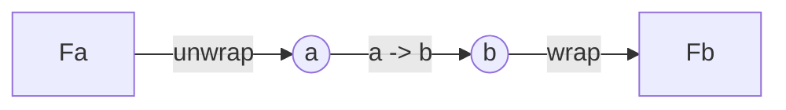

# Functor

## 範疇論角度

只要是限定在 [small category](./intuitive_category_theory.md)，那麼 functor 就是兩個函數：

1. 在 $Ob(\mathcal{C})$ 中的每個物件，在 $Ob(\mathcal{D})$ 中都有對應的物件

2. 在 $\mathcal{C}(a, b)$ 中的每個態射(morphism)，在 $\mathcal{D}(a, b)$ 中都有對應的態射，並且需保留對應的組合事實

## 實際在程式的作用

可以將一個 pure function 應用到容器型別之中

以單純從容器的角度來看，就像是隱藏了「取出→ 運算 → 放回去」的過程，而根據每個容器用途不同在過程中執行不同操作及判斷。



## Functor Laws

### identity

$$
fmap\ id = id
$$

### composition

$$
fmap\ (f \circ g) = fmap\ f \circ fmap\ g
$$

## Lean 中的定義

```lean
class Functor (f : Type u → Type v) : Type (max (u+1) v) where
  /-- If `f : α → β` and `x : F α` then `f <$> x : F β`. -/
  map : {α β : Type u} → (α → β) → f α → f β
  /-- The special case `const a <$> x`, which can sometimes be implemented more
  efficiently. -/
  mapConst : {α β : Type u} → α → f β → f α := Function.comp map (Function.const _)
```

取自於 lean [原始碼](https://github.com/leanprover/lean4/blob/2eaa400b8e641e88c3f97038c56390f98a818e23/src/Init/Prelude.lean#L2683-L2688)

[Lean doc Functor](https://leanprover-community.github.io/mathlib4_docs/Init/Prelude.html#Functor)

## Haskell 中的定義

```haskell
class Functor f where
  fmap :: (a -> b) -> f a -> f b
  (<$) :: a -> f b -> f a
```

取自於 [Haskell Functor wiki](https://wiki.haskell.org/Functor)

### 常見的 Functor Type

- Maybe / Option
  - Haskell (Maybe)
  - Lean (Option)
  - Rust (Option)
- Either / Result / Except
  - Haskell (Either)
  - Result (Rust)
  - Lean (Except)
- IO
  - Haskell (IO)
  - Lean (IO)
- Reader
  - 待補
- Writer
  - 待補
- State
  - 待補

#### 參考資源

待補
