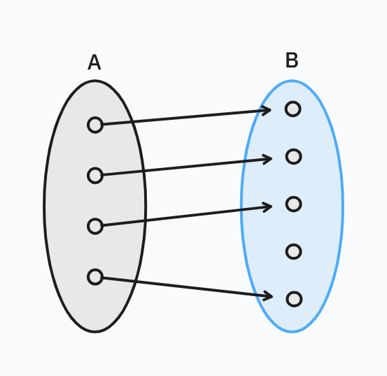
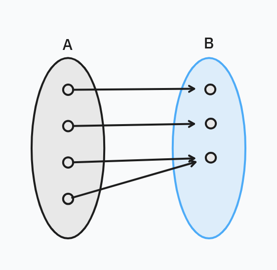
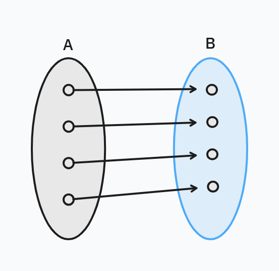

# Pure function

在程式中你可以利用 function 做許多事情，不只是單純的運算，還包含了各種值的修改及各種非同步操作，雖然方便但也造成了閱讀及維護上的困難，而盡可能得撰寫 pure function 是一個可以有效減輕開發上的心智負擔，並且是使你能夠靈活組合函數的一個前提。

## 函數的定義

一個 pure function 除了不能有副作用 (Side Effect) 之外，同時必須滿足在任何時間任何環境下同樣的輸入會得出相同的輸出，所以我們通常會以達到數學中全函數(total function)定義為目標來設計函數。

在數學中，函數是一個集合 (稱為**定義域 domain**) 到另一個集合 (稱為**值域 codomain**) 的映射，假設我們有個函數 $f : A \to B$ ，則 $A$ (domain) 中每個元素都必須對應到 $B$ (codomain) 中的一個元素，能達成 $A \to B$ 條件的函數總共有 $|B|^{|A|}$ 種，我們通常實現的都只會是其中幾種，而不是所有都實作。

Typescript

```typescript
// isEven : number -> boolean
function isEven(num: number): boolean {
    return num % 2 === 0
}
```

Haskell

```haskell
is_even :: Int -> Bool
is_even n = n `mod` 2 == 0
```

函數分三種類型，包含 **單射 (injection)**、**滿射 (surjection)**、**對射 (bijection)**。

### 單射 (injection)

假設我們稱一個函數 $f : A \to B$ 是單射，則 $A$ 與 $B$ 的元素關係都是一對一的，即

$$\forall a,b\in A,\ a\neq b \Longrightarrow f(a)\neq f(b)$$



我們可以從中得知另一個訊息是 $A$ 中的元素數量會小於等於 $B$ 元素數量，即 $|A|\le |B|$

### 滿射 (surjection)

我們稱一個函數 $f : A \to B$ 是滿射，則對於 $B$ 中所有的元素，都存在至少一個 $A$ 元素與其對應，即

$$\forall b \in B,\ \exist a \in A,\ f(a) = b$$



我們可以從中得知另一個訊息是 $A$ 中的元素數量會大於等於 $B$ 元素數量，即 $|A|\ge |B|$

### 對射 (bijection)

我們稱一個函數 $f : A \to B$ 是對射，則該函數同時達成單射與滿射條件，因為同時滿足 $|A|\le |B|$ 跟 $|A|\ge |B|$ 則 $|A| = |B|$



## 可預測與不可預測

## 透過單元測試難易度辨別函式純度

## 透過函式純度辨別單元測試難易度
